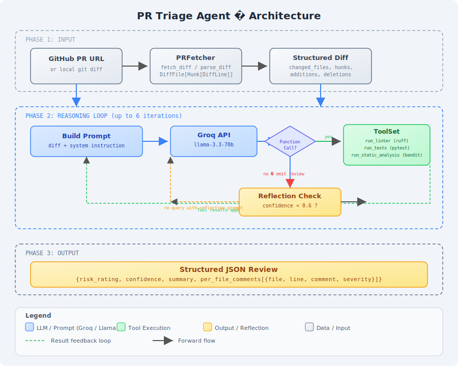

# PR Triage Agent

[](https://python.org)
[](LICENSE)
[-orange)](https://aistudio.google.com/apikey)
[](https://github.com/astral-sh/ruff)
[](https://bandit.readthedocs.io)
[]()

> Read code, not just diff. An autonomous PR review agent that fetches diffs, runs real linting/testing/SAST tools, reasons over results via Gemini, and produces structured reviews with risk ratings — all without a paid API.

---

## Demo

[]()

```text
$ python -m pr_triage_agent review https://github.com/psf/requests/pull/6963
┌────────────────────────────────────────────────┐
│  PR Triage Agent — Reviewing pull request       │
└────────────────────────────────────────────────┘
  ✓ Fetched diff (2 files, +20/-8)
  ✓ ruff: no new issues
  ✓ pytest: all tests passed
  ⚠ bandit: potential issue in auth.py (line 178)

┌────────────────────────────────────┐
│  Risk Rating: high                 │
│  Confidence: 0.88                  │
│  Summary: Fixes CVE-2024-47081     │
└────────────────────────────────────┘

┌─────────────────────────────────────────────────────┐
│ File              │ Line │ Severity │ Comment        │
├───────────────────┼──────┼──────────┼────────────────┤
│ requests/auth.py  │ 178  │ high     │ Netloc creds…  │
└─────────────────────────────────────────────────────┘
```

---

## Architecture



**How it works (3 phases):**

### Phase 1: Input
`PRFetcher.fetch_diff()` calls the GitHub REST API (`Accept: application/vnd.github.v3.diff`) to get the unified diff of a PR, then `parse_diff()` converts it into structured dataclasses — `DiffFile` → `Hunk` → `DiffLine` with tracking of old/new line numbers, file status (added/modified/deleted/renamed), and add/delete counts. Also supports local git mode (`git diff base...head`).

### Phase 2: Reasoning Loop
1. **Build Prompt** — The structured diff and list of changed files are embedded in a system prompt that instructs the LLM (Gemini 2.5 Flash) to act as a code reviewer.
2. **Tool-Augmented Generation** — The LLM can request tool calls: `run_linter` (ruff), `run_tests` (pytest), `run_static_analysis` (bandit), `read_file`, and `search_codebase`. Each result is appended to the conversation history.
3. **Iterative Reasoning** — Up to 6 rounds of tool calls. The LLM decides when it has enough evidence to produce the final review.
4. **Reflection** — If the LLM's self-reported confidence is below 0.6, a reflection prompt re-queries the model to reconsider its findings. Only one extra round.

### Phase 3: Output
The agent produces a structured JSON review: `{risk_rating, confidence, summary, per_file_comments[{file, line, comment, severity}]}`. Nothing is auto-merged or auto-approved — all output is human-gated.

---

## Evaluation Results

We curate a dataset of **16 real merged PRs** from 6 popular Python projects (cpython, flask, click, httpx, requests, poetry) and compare the agent's flagged issues against documented ground-truth issues from the PR descriptions and review comments.

| Metric | Value |
|--------|-------|
| **Precision** | *(requires API key — run `python -m pr_triage_agent eval`)* |
| **Recall** | *(requires API key — run `python -m pr_triage_agent eval`)* |
| **F1 Score** | *(requires API key — run `python -m pr_triage_agent eval`)* |
| **Dataset Size** | 16 PRs |
| **Issue Types** | security, logic_bug, missing_error_handling, regression |

**Run it yourself:**
```bash
python -m pr_triage_agent eval --limit 5
```

Results are written to `pr_triage_agent/evaluation/results/` as per-PR JSON files and an aggregate `results_summary.md`.

---

## Key Engineering Decisions

### Why free-tier Gemini + sleep-based rate limiting
The goal was a fully functional agent with **zero API cost**. Gemini 2.5 Flash is free (15 requests per minute). A simple `time.sleep(4)` rate limiter with exponential backoff on 429s keeps us compliant without a token bucket library. Cost logging to SQLite tracks usage for when you eventually want to upgrade.

### Why hand-wrapped tools instead of LangChain / CrewAI
Heavy agent frameworks abstract away the function-calling loop and make debugging harder. By hand-wrapping 5 tools (`ToolSet` returning `ToolResult` dataclasses with auto-truncation), each `AgentLoop.run()` iteration is explicit: model response → is it a function call? → execute → append to contents → continue. This fits in ~470 lines and is trivially swappable to other languages (replace `run_linter` with ESLint, `run_tests` with Jest, etc.).

### How the reflection step works
When the LLM emits a review JSON with `confidence < 0.6`, `ReflectionLoop.build_reflection_prompt()` creates a prompt that lists the tool evidence gathered so far and explicitly asks: *"Review the evidence above and reconsider your assessment. Are there additional issues? Were any incorrectly identified?"* This is appended as a user message and the model is re-queried once.

### Graceful failure handling
Every `ToolResult` wraps errors (missing binary, timeout, non-existent file) so the LLM sees `{"success": false, "error": "..."}` rather than a crash. The agent loop continues; if output is truncated at 3000 chars, the LLM is told so. If the agent exceeds 6 iterations without producing valid JSON, the error is returned for human inspection.

---

## Setup

### Requirements
- **Python 3.11+**
- A **free Gemini API key** from [Google AI Studio](https://aistudio.google.com/apikey)

### Install
```bash
pip install -r requirements.txt
```

### Configure
```bash
python -m pr_triage_agent init
# Edit the .env file that was created:
#   GEMINI_API_KEY=your_key_here
#   GITHUB_TOKEN=optional_github_token
```

> **Note:** Without `GITHUB_TOKEN`, unauthenticated GitHub API calls are limited to 60/hour. Set one for development use (no special permissions needed — public repo access only).

---

## Usage

### Review a PR
```bash
python -m pr_triage_agent review https://github.com/psf/requests/pull/6963
```

### Review a local branch
```bash
python -m pr_triage_agent review \
    https://github.com/psf/requests/pull/6963 \
    --repo-path /path/to/repo \
    --base main \
    --head feature-branch
```

### Run evaluation against the dataset
```bash
python -m pr_triage_agent eval
python -m pr_triage_agent eval --limit 3         # first 3 PRs
python -m pr_triage_agent eval --no-skip-existing  # re-run all
```

### Demo (no API key needed)
```bash
python pr_triage_agent/assets/demo_review.py
```

---

## Project Structure

```
pr_triage_agent/
├── __init__.py          # version
├── __main__.py          # python -m entrypoint
├── cli.py               # argparse CLI (review/eval/init commands)
├── agent/
│   ├── loop.py          # AgentLoop: fetch → prompt → tool call → review
│   ├── state.py         # AgentState dataclass
│   ├── tools.py         # ToolSet: ruff, pytest, bandit, read, search
│   └── reflection.py    # ReflectionLoop: low-confidence re-query
├── github/
│   └── fetch.py         # PRFetcher + parse_diff + dataclasses
├── llm/
│   └── gemini_client.py # Rate-limited Gemini wrapper + cost logging
├── storage/
│   └── db.py            # SQLite: cost_log, review_history
├── evaluation/
│   ├── dataset.json     # 16 PR ground-truth dataset
│   ├── run_eval.py      # EvaluationHarness: metrics computation
│   └── results/         # Per-PR result JSON + summary markdown
├── assets/
│   ├── architecture.svg # Architecture diagram
│   └── demo_review.py   # Interactive demo script
└── tests/
    ├── test_gemini_client.py  # 10 tests
    ├── test_fetch.py          # 16 tests
    ├── test_tools.py          # 21 tests
    ├── test_agent_loop.py     # 5 tests
    └── test_evaluation.py     # 31 tests
```

**Total: 83 tests** — run them with:
```bash
pytest
```

---

## Limitations & Future Enhancements

- **Small evaluation set** — 16 PRs provides directional signal but isn't statistically significant. Growing the dataset to 100+ PRs across more languages would improve confidence.
- **Python-only tools** — Linter, tester, and SAST are all Python tools (ruff, pytest, bandit). The architecture supports swapping these, but no other languages are wired yet.
- **Free-tier constraints** — Gemini 2.5 Flash has a 1M token context window and 15 RPM limit. Large diffs (>50 files) may need chunking.
- **No inline PR comments** — The agent outputs structured JSON but doesn't post comments to GitHub yet (intentional — review is human-gated).
- **Single-pass reflection** — The reflection loop runs at most once. A more sophisticated agent might do recursive search (find issue → search related code → refine).
- **No streaming** — The full agent loop runs synchronously. Could add streaming output via `rich.live` for a smoother UX.

---

*Built with Python, Gemini, and curiosity. MIT licensed.*
